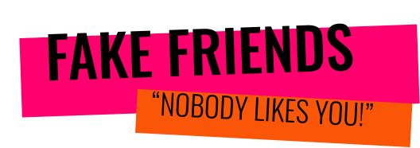

    

<h1 align="center">
<a href='https://fakefriends.gg/'>Fake Friends</a>
</h1>

  
  
  
  

**Fake Friends**, a Jackbox.tv style party game where you can separate your real friends from your fake ones!

One player creates a survey, and sends a link to their friends. Then, they all join a room together and compete to see who knows their friend best!

# **How to play**

- **Make a new survey**: one player will create a 5 question survey of yes or no questions.
 
<image width=400 align="center" src="./public/assets/examplequestion.png">

- **Send a room code to your friends**: they will send a room an auto-generated room code to their friends to play their survey.
 
<image width=400 align="center" src="./public/assets/roomcode.png">

- **Join the lobby**: a group of up to 6 friends will enter the room code and join the lobby, and once they're all ready the game will start.
 
<image width=400 align="center" src="./public/assets/lobby.png">

- **Pick a winner**: whoever answers the most questions right by the end will be crowned the only "true" friend!
 
<image width=400 align="center" src="./public/assets/winner.png">